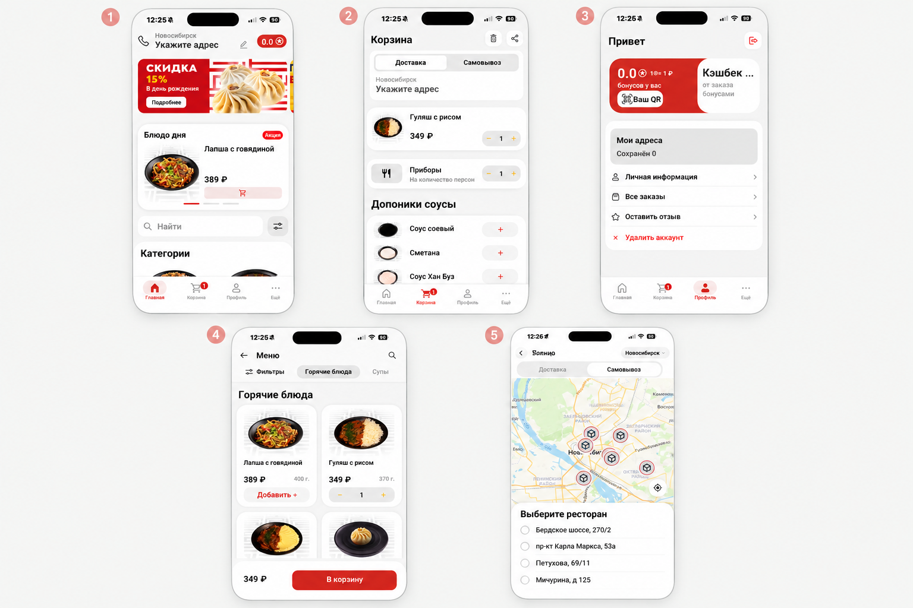
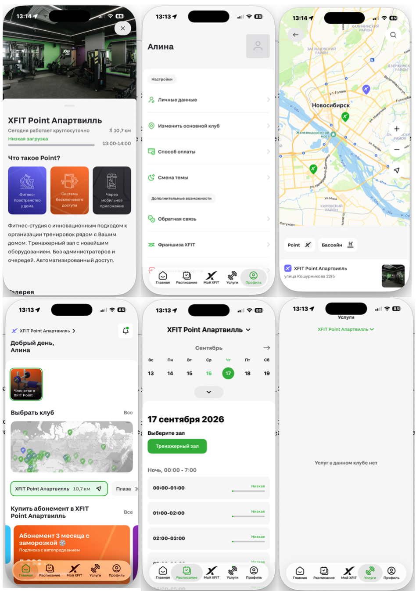
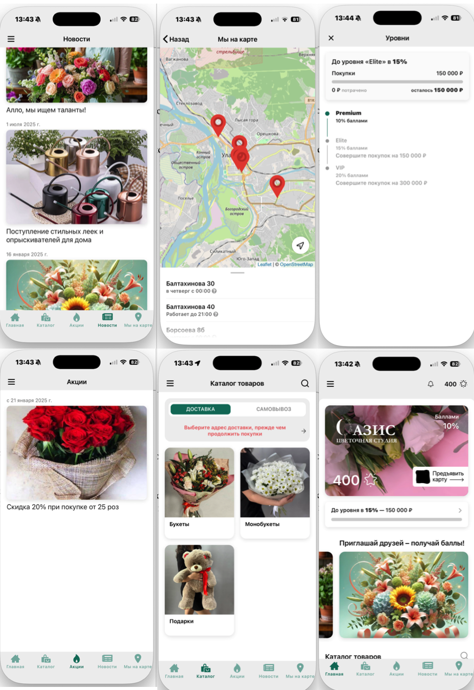

# Изучение приложений малого бизнеса

## ХанБуз

1. Ханбуз - сеть кафе с службой доставки еды.

2. **Пользовательские сценарии:** заказ без очереди (оформит заранее), быстрая доставка, поиск ближайшего ресторана, использование бонусов, выбор из ограниченного меню

3. **Экраны:**
- Главная - акции, категории блюд, возможность поиска блюд;
- Корзина - выбор доставка/самовывоз, доп предложения, промокод, оформление заказа;
- Профиль - программа лояльности, личные данные;
- Меню - карточки блюд, фильтры, категории;
- Карта - текущая геопозиция, расположение ресторанов;

4. **UI-компоненты**:
- Card
- Bottom
- Filter
- List/Collection
- QR Code
- Bottom Tab Bar
- Map
- Header
- Address Selector
- Search Bar
- Add Button

5. **Модель данных:** 
Пользователь, Адрес, Город, Ресторан / Филиал, Корзина, Позиция корзины, Заказ, Статус заказа, Способ получения (доставка / самовывоз), Способ оплаты, Бонусный счёт

6. **Пользовательские действия**:

- Просмотр меню
- Оформление заказа (доставка/самовывоз)
- Применение бонусов/промокодов
- Получение push-уведомлений

7. Интересные mobile-specific возможности

- Геолокация для поиска ближайшего кафе — приложение использует GPS для определения ближайших филиалов и построения маршрута .
- Push-уведомления - запрашиваются соответствующие разрешения, что позволяет информировать о статусе заказа и акциях 
- Интеграция с Яндекс Go — доставка осуществляется через сторонний сервис

8. **Специфические возможности**: 
Меню, доставка, заказ еды, кэшбек, рестораны на карте, программа лояльности

## XFit

1. XFit - тренажерный зал

2. **Пользовательские сценарии:** 
- Покупка абонимента
- Выбор финтнес-клуба
- Запись на тренировки
- Просмотр загруженности трегажерного зала

3. **Экраны:**
- Авторизация 
- Главный - переход к карте, выбор абонимента, подарочные сертификаты, переход к экрану "О клубе"
- Расписание - календарь
- "О клубе" - информация про XFit (адрес, контакный номер, цены и тд)
- Карта - расположение фитнес клубов
- Услуги
- Профиль - личные данные

4. **UI-компоненты**:
- Bottom
- List/Collection
- Bottom Tab Bar
- Map
- Header
- Calendar

5. **Модель данных:** 
Пользователь, Фитнес клуб, Абонимент, Способ оплаты

6. **Пользовательские действия**:

- Покупка, продление, смена подписки
- Заморозка подписки
- Запись на тренировку / отмена
- Просмотр истории посещений
- Получение уведомлений 
- Выбор клуба на карте

7. Интересные mobile-specific возможности

- Геолокация для поиска ближайшего фитнес клуба — приложение использует GPS 
- Push-уведомления - одтверждение записи, напоминания, изменения в расписании
- Заморозка подписки

8. **Специфические возможности**: 
Оформление абанимента, история посещений, заморозка абонимента

## Цветы Оазис

1. Цветы Оазис - локальный цветочный салон с доставкой

2. **Пользовательские сценарии:** 
- Выбор букета/подарка из каталога
- Оформление доставки/заказа самовывозом
- Поиск салонов на карте
- Накрпление/использование баллов
- Отслеживание акций

3. **Экраны:**
- Авторизация 
- Главный - карта лояльности, переход в каталог, новости
- Каталог - карточки букетов/подарков
- Акции
- Карта - расположение салонов
- Новости

4. **UI-компоненты**:
- Bottom
- List/Collection
- Bottom Tab Bar
- Map
- Header
- Cards
- QR-code

5. **Модель данных:** 
Пользователь, Бонусы, Способ оплаты, Адрес салона, Адрес доставки, Акции

6. **Пользовательские действия**:

- Просмотр каталога цветов и подарков
- Оформление заказа с доставкой/самовывозом 
- Накопление и списание баллов 
- Просмотр акций и новостейй
- Получение уведомлений 
- Выбор салона на карте

7. Интересные mobile-specific возможности

- Геолокация для поиска ближайшего салона
- Push-уведомления - о начислении бонусов и акциях
- Бонусы за регистрацию

8. **Специфические возможности**: 
персональная скидка, бонусы за покупки

#### Паттерны
- Каталог
- Карточка сущности
- Профиль пользователя
- Push-уведомления
- Оплата
- Авторизация 
- Поиск и фильтры
- Программа лояльности
- Bottom Tab Bar — основная навигация по разделам.
- Уведомления и статусы

### Дополнительно 
#### Универсальные элементы
- List / Collection — каталог, расписание, история, список точек
- Card — товар, блюдо, клуб, букет
- Carousel — промо-баннеры, карточки дня
- Tabs / Bottom Tab Bar — основная навигация
- Search Bar + Filter — поиск и фильтрация
- Profile — личные данные, настройки
- Tag / Chip — «Акция», категории
- Notification — push и внутренние уведомления
- Calendar — расписание занятий
- Map — карта точек и навигация
- QR Code — бонусная карта, вход в зал

#### Универсальные no-code actions
- Изменить количество
- Оформить заказ
- Выбрать способ получения (доставка/самовывоз)
- Выбрать адрес / точку
- Применить промокод / списать бонусы
- Купить / продлить подписку
- Выйти из аккаунта / удалить аккаунт
- Получить push-уведомление

#### Domain-specific возможности
- Логика лояльности
- Сезонные акции
- Замарозка подписки
 
